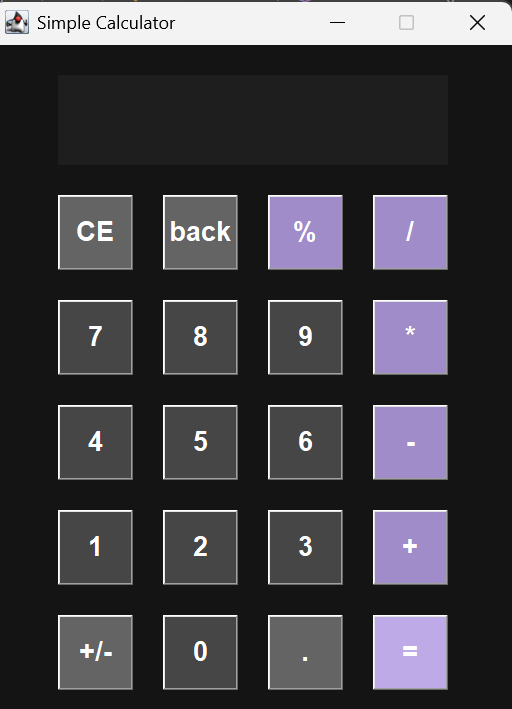

<h1> Java AWT Calculator</h1>

A GUI-based calculator application built using Java AWT, designed to perform basic arithmetic operations with proper operator precedence, keyboard support, and error handling. The project focuses on clean structure, usability, and core Java concepts.

<h2> Features</h2>
<li>Basic arithmetic operations: + - * / %</li>
<li>Button-based and keyboard input support</li>
<li>Decimal number handling</li>
<li>Operator precedence–based expression evaluation</li>
<li>Error handling (divide by zero, invalid expressions)</li>
<li>Clean and simple AWT-based user interface</li>
